It can be difficult to get everything correctly on your machine. If it’s not working, don’t dwell on it and test on the servers for now.

## Windows Instructions:

1. Download `hamcrest-core-1.3.jar` and `junit-4.12.jar` from canvas.
2. Add them to your classpath: `set CLASSPATH=.;C:\Users\Samuel Wallan\Desktop\junit-4.12.jar.;C:\Users\Samuel Wallan\Desktop\hamcrest-core-1.3.jar `Replace the path to the files with where they are on your computer, and make sure that the punctuation is exactly the same. `

Inside directory where your files are:

1. Compile: `javac Point.java TestCases.java`
2. Run: `java org.junit.runner.JUnitCore TestCases`: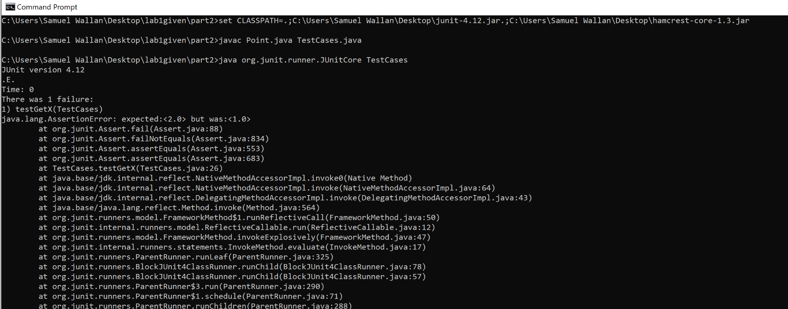


## Mac Instructions:

1. Download `hamcrest-core-1.3.jar` and `junit-4.12.jar` from canvas.
2. Add them to your classpath: `export CLASSPATH="$CLASSPATH:/Users/swallan/Downloads/hamcrest-core-1.3.jar:/Users/swallan/Downloads/junit-4.12.jar:."` Replace the path to the files with where they are on your computer, and make sure that the punctuation is exactly the same.
3. Compile: `javac Point.java TestCases.java`
4. Run: `java org.junit.runner.JUnitCore TestCases`: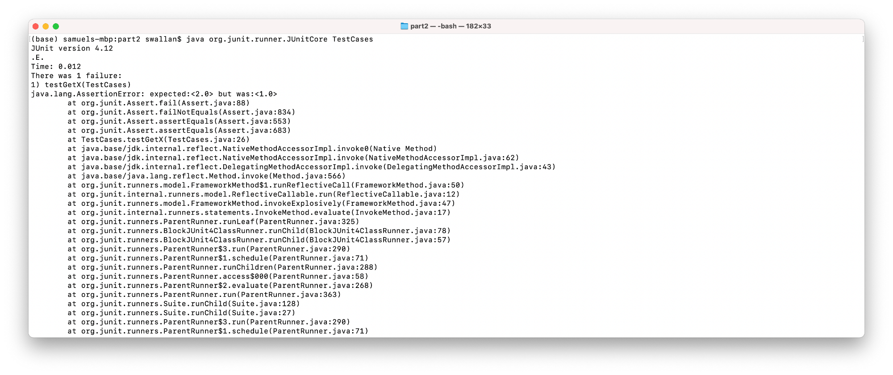


## IntelliJ


First you'd need to download IntelliJ (linked on canvas) and download the junit and hamcrest jar files (on the bottom of the canvas page). Then:


1. Open the files for lab 1 part 1
   1.  open IntelliJ and select 'File->New->project from Existing Sources...' 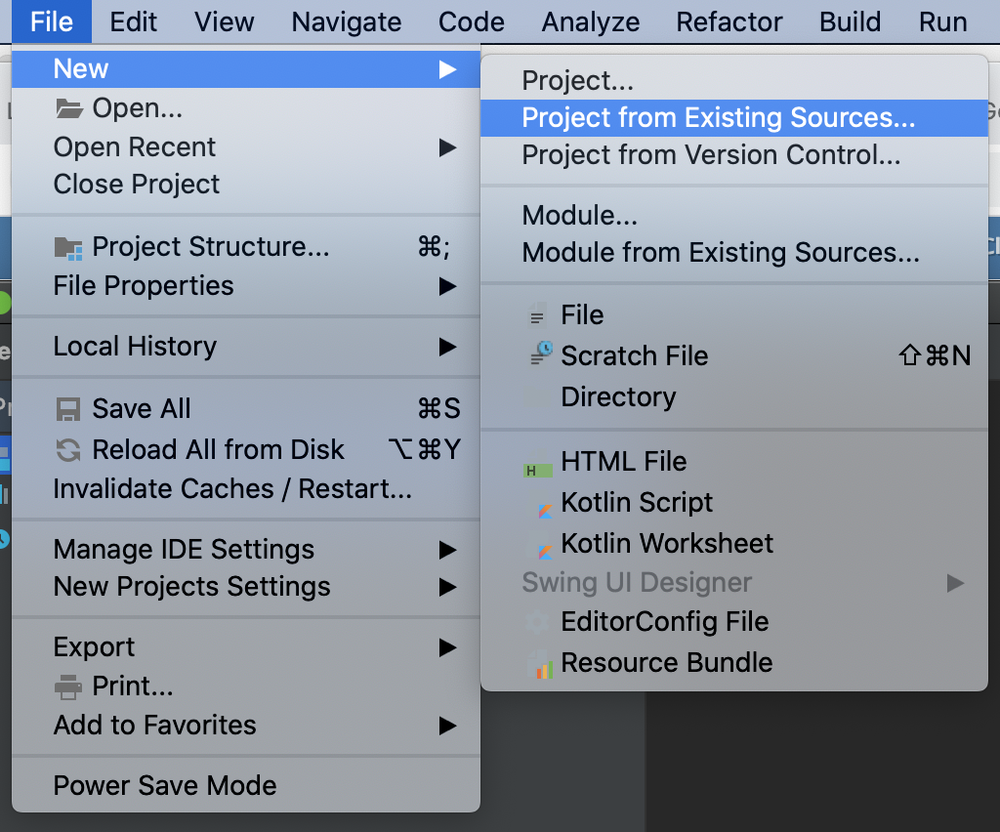
   2.  Select the part 1 folder:
   3.  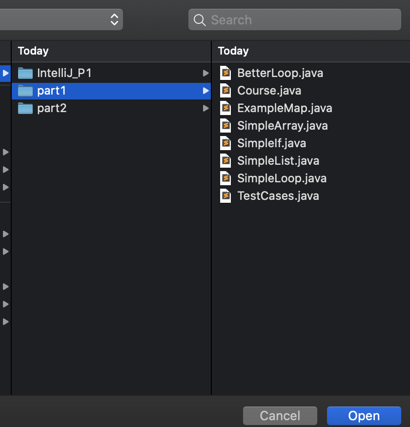
   4.  hit next through the options, making sure to select 'Create project from existing source'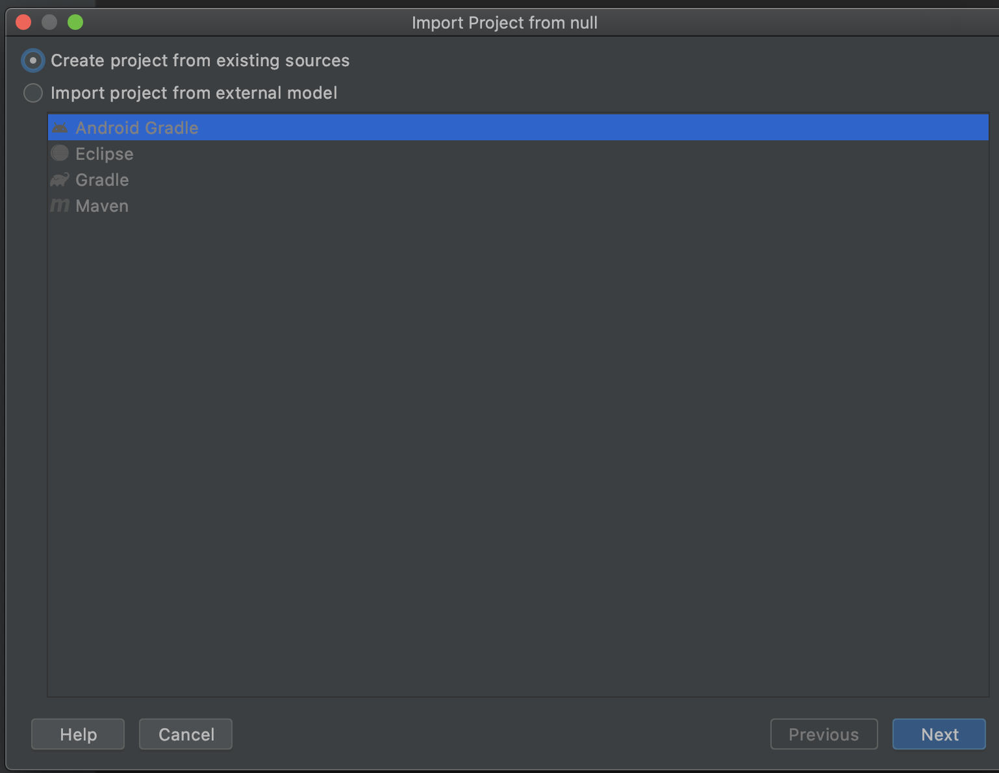
2. Once open, make sure the .java files have blue circles with a c as the symbol next to them (not an orange circle with a j). If it is not that configuration, you may need to right click on the folder they are in in IntelliJ and mark the directory as 'Sources root'
   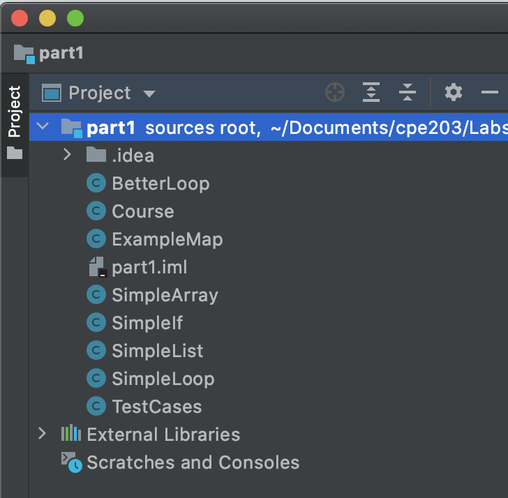 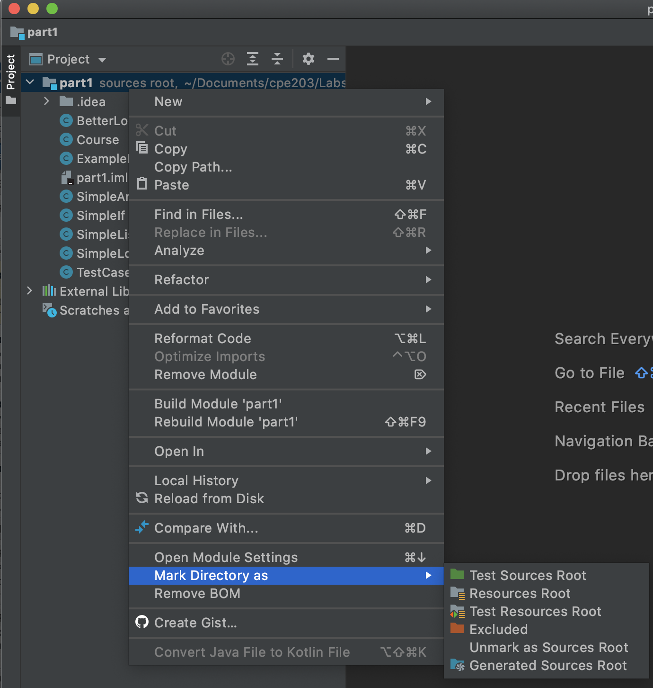
3. Then, select 'File->Project Structure' and select 'Modules' on the left panel and 'Dependencies' from the top options: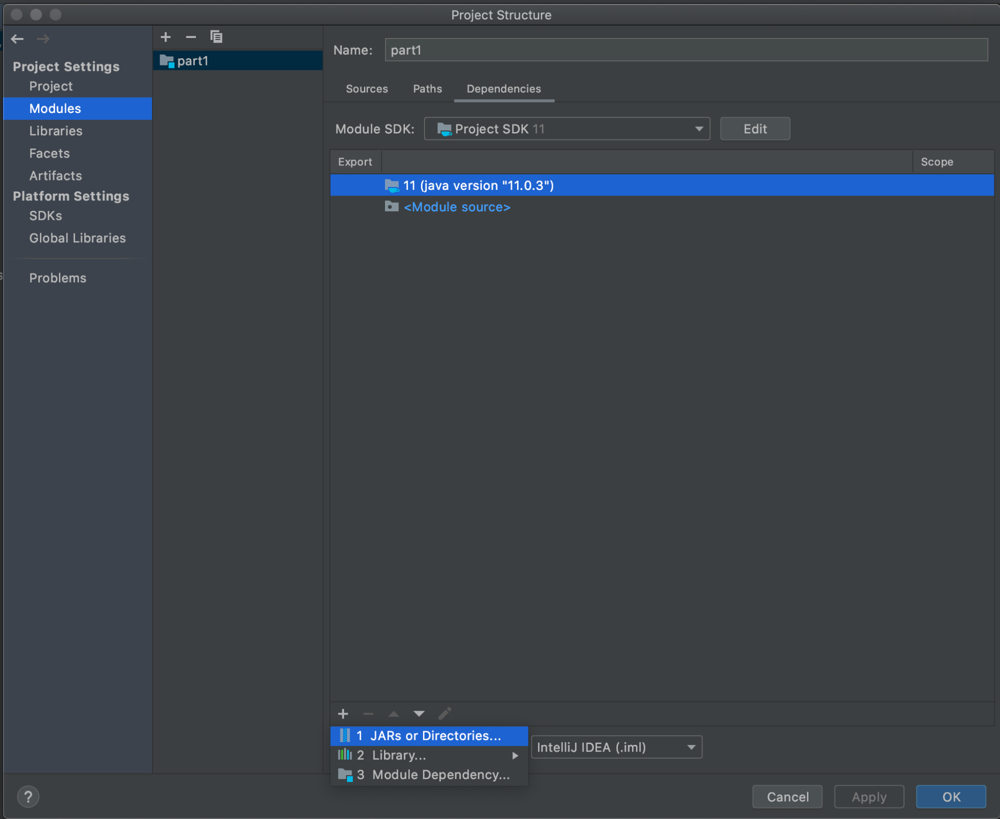
4. Select the little '+' bottom on the bottom and pick '1 JARs or Directories'.
5. Add the two downloaded files by finding them in your computer's folders.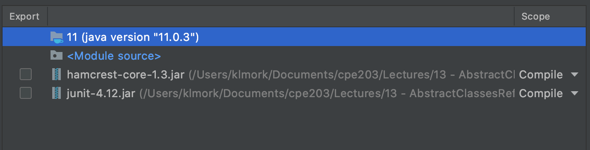
6. select OK
7. At the top of the IntelliJ window select 'Edit Configuration' to the left of the green or grayed out play button:
   
8. Click the '+' button in the top left of the window that opens: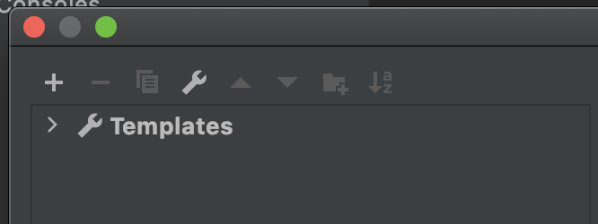
9. Click Jar Application:
   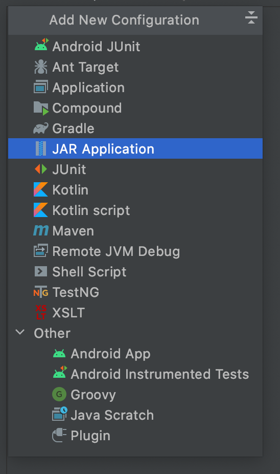
10. Select the path to the junit file (don't worry about hamcrest for this step).
11. Now the green play buttons should appear in your TestCases.java file (double click on the file to open it in IntelliJ).
    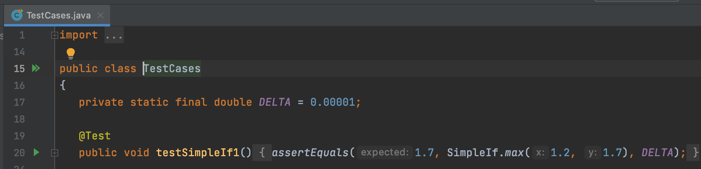
12. Click the play buttons to run the test cases (the one on line 15 in the image above would run all of them. The one on line 20 would just run that individual test case).


## Windows Subsystem for Linux (WSL)


The secondary way is to [install WSL(Windows Subsystem for Linux) and choose Ubuntu](https://www.microsoft.com/en-us/p/ubuntu/9nblggh4msv6?activetab=pivot:overviewtab). After that, open an *elevated* command prompt, and run this command: `dism.exe /online /enable-feature /featurename:Microsoft-Windows-Subsystem-Linux /all`. Then all you have to do is to search “Ubuntu” from your windows taskbar, open it, and you’ll get a terminal window. Now run the following to configure the environment:

```
sudo apt install openjdk-11-jdk-headless
sudo apt install junit5
```

and you’re done!

Otherwise, to have it accessible in cmd, you need to add a couple of [environment variables](https://www.tutorialspoint.com/junit/junit_environment_setup.htm). To edit the environment variables, press windows key and letter R at the same time, and then paste in the following: `rundll32.exe sysdm.cpl,EditEnvironmentVariables`

I haven’t tried this since I used the previous two approaches, but it should still work fine.

P.S/X-Post: To get JUnit working on the centos server the school has, add this to the bottom of your `.mybashrc` file in your $HOME directory:

```
export CLASSPATH=/home/akeen/public/junit-4.12.jar:/home/akeen/public/hamcrest-core-1.3.jar:${CLASSPATH}:.

alias run="javac *.java && java org.junit.runner.JUnitCore "

Visit ‘Manage Class’ to disable runnable code snippets ×
```

You can now either restart your ssh session or run `source .mybashrc` to apply the changes. Now, you can type `run yourClassName` to BOTH compile and run your program with JUnit configured.
